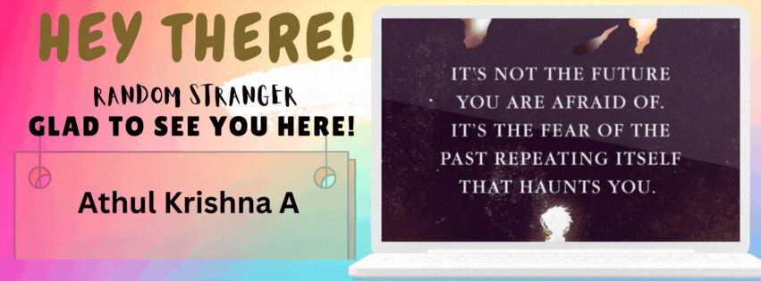

<h1 align='center'> I'm a Software Developer(AI/ML) with a knack of developing partially completed projects :) </h1>
<h2 align='left'> Tech stacks I have met so far! </h2>

  
  
  
  
  
  
  
  
  
  

<h2 align='left'> Connect with me </h2>

  
  

