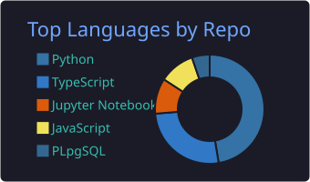
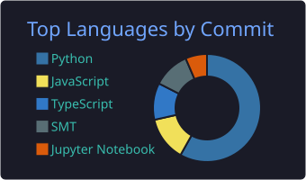
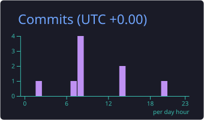

<p align="center">
  
</p>

<p align="center">
  <a href="https://www.linkedin.com/in/athul-krishna-a-826146238/">
    
  </a>
  <a href="mailto:athulkrishna8781@gmail.com">
    
  </a>
  <a href="https://github.com/AKomplished-bug">
    
  </a>
</p>

<br/>

I build **real-time voice AI** — the streaming STT → LLM → TTS pipelines behind phone agents that answer, understand, and talk back in under a second. Right now that means telephony for regulated **BFSI** and **healthcare**, on [LiveKit](https://livekit.io) + SIP.

```text
now      Voice AI Engineer @ Ignosis AI       BFSI voice platform · sub-700ms · LiveKit SIP
before   Voice AI Engineer @ Core Cognitics   multi-tenant voice AI · 10k+ calls/day
```

<br/>

### What I'm doing

**`~/ignosis`** &nbsp;— A real-time voice platform for BFSI (debt-collection) telephony on LiveKit SIP (Exotel/Vobiz trunks). Targeting **sub-700 ms** end-to-end latency with full barge-in, per-provider STT/LLM/TTS failover, and an offline eval harness (WER + LLM-as-judge) that replays production calls to catch regressions before users do.

**`~/core-cognitics`** &nbsp;— Co-led a multi-tenant voice AI platform on the LiveKit Agents SDK handling **10k+ calls/day** across healthcare & automotive. Multilingual (Arabic / Indic / European) with mid-call provider switching, a multi-layer guardrail system, MCP tool servers, and a RAG stack on Qdrant.

**`~/open-source`** &nbsp;— Found and reported a bug in the [LiveKit Agents SDK (#5665)](https://github.com/livekit/agents/issues/5665) — STT errors closing the session without the tolerance counter LLM/TTS errors get.

<br/>

### Toolkit

**Voice AI** &nbsp;&nbsp; `LiveKit` · `Pipecat` · `Deepgram` · `ElevenLabs` · `OpenAI Realtime` · `Gemini Live` · `Silero VAD`

**LLM & Agents** &nbsp;&nbsp; `Claude` · `OpenAI` · `LangGraph` · `MCP` · `RAG` · `Qdrant`

**Languages** &nbsp;&nbsp; `Python` · `TypeScript` · `Java` · `SQL` · `Bash`

**Infra & Obs** &nbsp;&nbsp; `Docker` · `Kubernetes` · `AWS` · `PostgreSQL` · `Redis` · `Kafka` · `Grafana` · `Prometheus` · `Langfuse`

<br/>

### Selected projects

**[oneNote_AI](https://github.com/AKomplished-bug/oneNote_AI)** &nbsp;— Multi-agent model for academic note generation. <sub>`Python`</sub>

**[AI-Call-Operator](https://github.com/AKomplished-bug/AI-Call-Operator)** &nbsp;— Multilingual voice call-center for disaster response — Sarvam TTS · Google STT · Llama 3. <sub>`Python`</sub>

**[edulex](https://github.com/AKomplished-bug/edulex)** · **[teacher](https://github.com/AKomplished-bug/edulex-teacher)** &nbsp;— AR adaptive-learning assistant for dyslexic students, voice-driven via Gemini Realtime. 🏆 ₹1L @ Spark Venture 2024. <sub>`TypeScript`</sub>

**[Medical-chatbot](https://github.com/AKomplished-bug/Medical-chatbot-)** &nbsp;— RAG-powered medical assistant. <sub>`Python`</sub>

<br/>

### Stats

<p align="center">
  
  
</p>
<p align="center">
  
</p>

<p align="center"><sub>Obsessed with latency budgets. Occasionally finishes side projects. 🎙️</sub></p>
